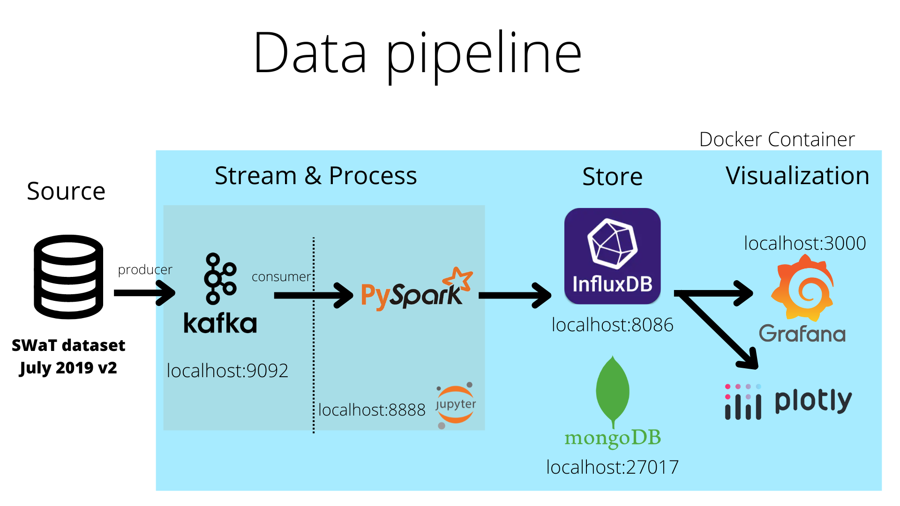
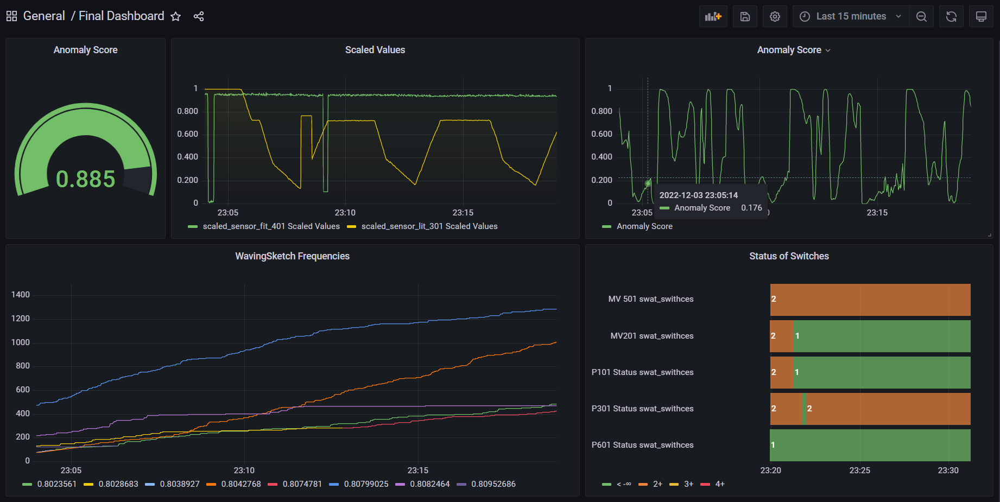

# SWaT-Dataset-Streaming-Framework

## Abstract

Industrial control Systems are widely utilized across industries, and usually use different sensors and
various embedded systems over a distinct network to operate. Such solutions are prone to cyber-
physical attacks over their network, and while system security is a well-researched and documented
area, attacks can evade detection. Industrial Control Systems (ICS) have moved from independently
isolated frameworks to interconnected frameworks that use the current communication landscape and
protocols to expand efficiency, diminish operational expenses and further improve an organization’s
help model.
Intrusion detection systems are used to detect attacks against networks and systems. The main task
of these systems is detecting malicious activities and to report the type of attacks. Intrusion Detec-
tion Systems are divided into two, Signature-Based and Anomaly-based Intrusion Detection Systems.
Signature-Based Intrusion Detection Systems use attack signatures in the database to detect attacks.
These systems can only detect attacks in the attack database. They have no chance of detecting new
attacks. On the other hand, Anomaly Based Intrusion Detection Systems detect anomalies in network
traffic without using attack signatures. Since these systems do not use any attack signature, they
may generate false alarms. It is also possible to detect new attacks with Anomaly Based Intrusion
Detection Systems.
In this article, we present an open-source pipeline as a framework to monitor and analyze the stream of
Secure Water Treatment. We used different open-source technologies such as Kafka, Spark, InfluxDB,
Grafana, Plotly, and MongoDB combining them using Docker.

## Framework Pipeline

## Team members

- Óscar Cabrera Rodríguez
- Elshan Gadimov
- Haddad Philip
- Yazgan Pinar
- Joao Pinherio

## Grafana Dashboard

